# MedSecure-FortiNet

## Secure Healthcare Network with FortiGate

Design and deployment of a secure network infrastructure for a healthcare environment using **FortiGate**, **FortiAnalyzer**, **IPsec VPN** and **SSL-VPN**.

## Overview

MedSecure-FortiNet is a cybersecurity networking project focused on securing communications, segmenting the infrastructure and monitoring network activity within a healthcare environment.

The project was designed and deployed in a virtualized laboratory environment using **PNETLab** and **VMware**.

## Key Features

* Network segmentation using VLANs
* Site-to-site IPsec VPN
* Secure remote access using SSL-VPN
* DMZ architecture
* Firewall security policies
* Centralized logging with FortiAnalyzer
* Network monitoring and security analysis

## Architecture


## Technologies

* FortiGate
* FortiAnalyzer
* IPsec VPN
* SSL-VPN
* VLAN
* PNETLab
* VMware

## Skills Demonstrated

* Network Security Architecture
* Firewall Configuration & Security Policies
* Network Segmentation with VLANs
* Site-to-Site IPsec VPN
* SSL-VPN Remote Access
* Network Addressing & Routing
* Security Logging & Monitoring
* FortiAnalyzer Log Analysis
* Virtualized Network Lab Deployment
* Network Troubleshooting & Validation

## Project Structure

```text
MedSecure-FortiNet/
│
├── docs/
│   ├── README.md
│   ├── architecture/
│   │   └── network-topology.png
│   ├── diagrams/
│   │   ├── ipsec-communication-flow.png
│   │   ├── ssl-vpn-medical-staff-flow.png
│   │   └── patient-portal-flow.png
│   └── screenshots/
│
├── fortigate/
│   ├── README.md
│   ├── clinique/
│   │   └── README.md
│   └── labo/
│       └── README.md
│
├── fortianalyzer/
│   └── README.md
│
├── vpn/
│   └── README.md
│
├── network/
│   ├── vlan/
│   │   └── README.md
│   └── ip-plan/
│       └── README.md
│
└── README.md
```

## Implementation & Evidence

### VLAN Segmentation

The network is divided into dedicated VLANs to isolate users, servers and management traffic.

The FortiGate infrastructure was configured to support network segmentation and controlled communication between the different network zones.

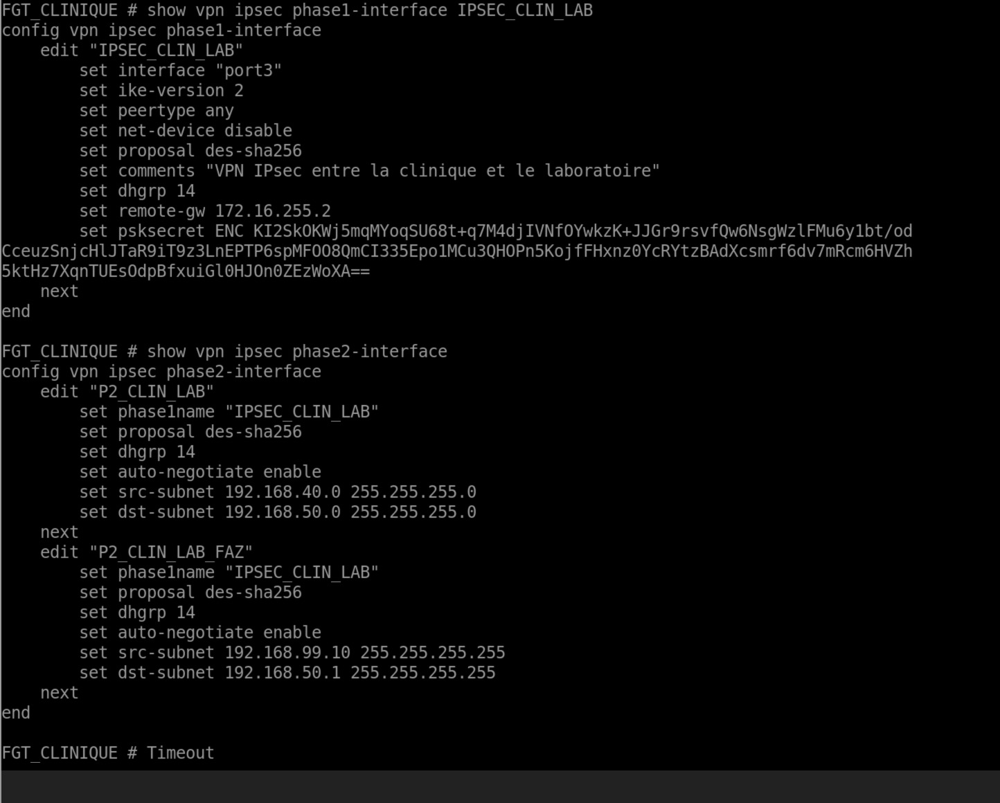

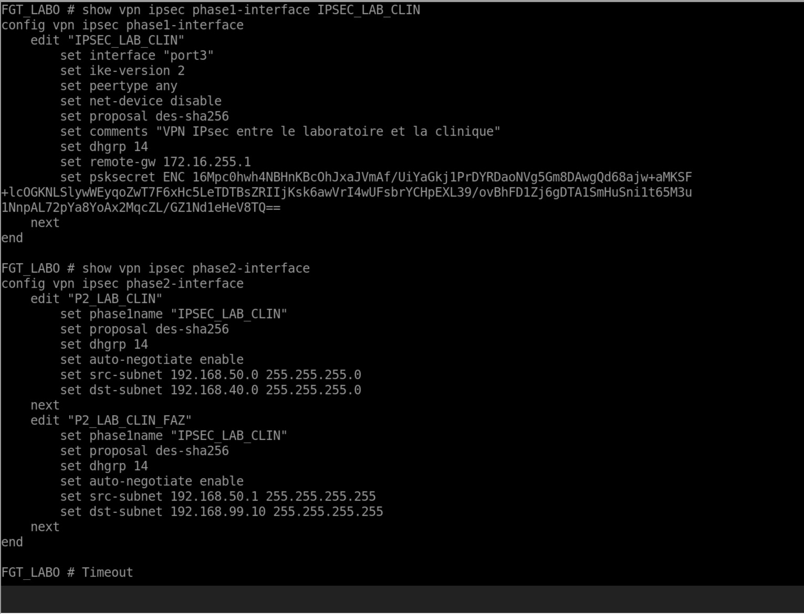

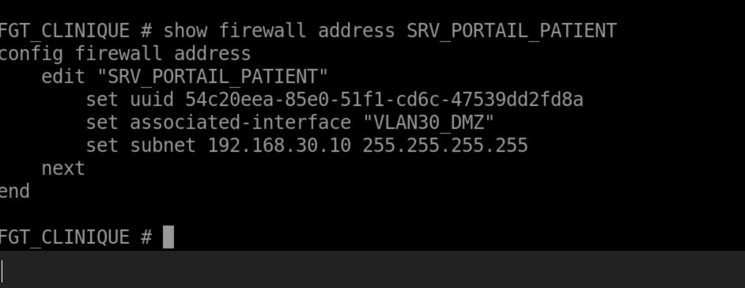

### Network & Server Configuration

Network objects, application servers, patient-related resources and required services were configured according to the defined security architecture.

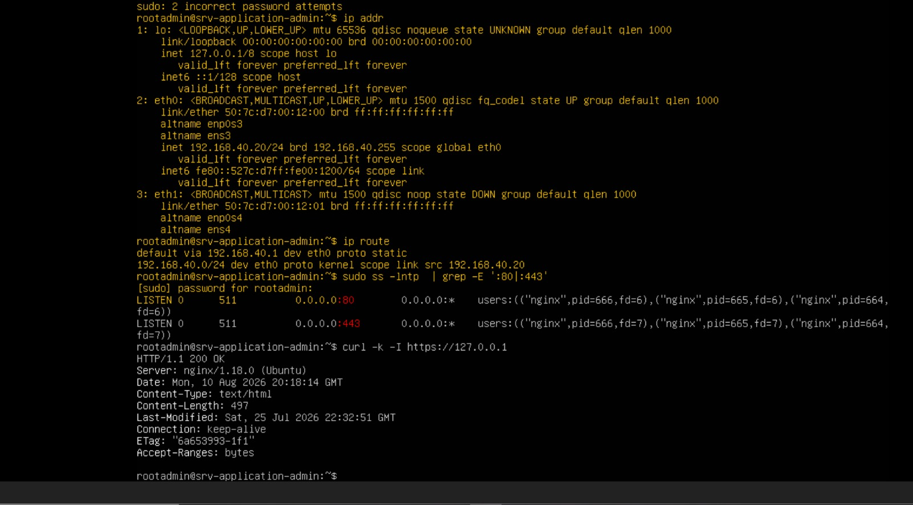

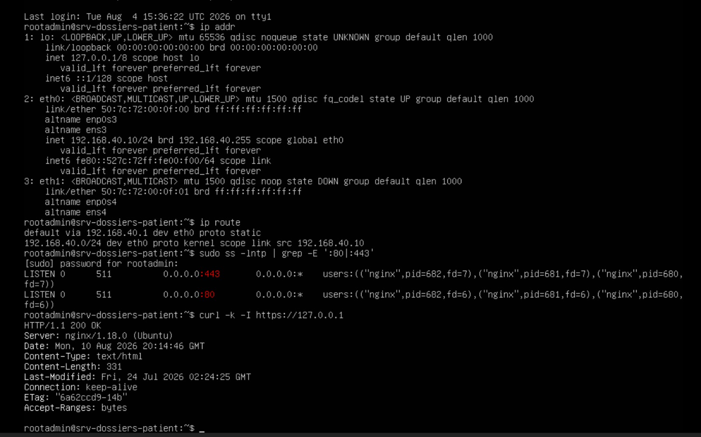

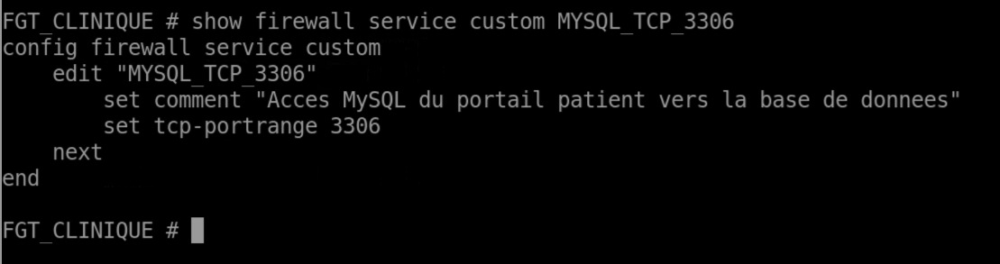

### IPsec VPN

An IPsec tunnel securely connects the clinic and laboratory sites, enabling controlled communication between the two infrastructures.

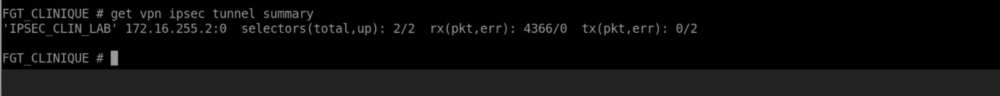

### SSL-VPN

SSL-VPN provides secure remote access for authorized medical staff.

The configuration includes the dedicated SSL-VPN address pool and access configuration.

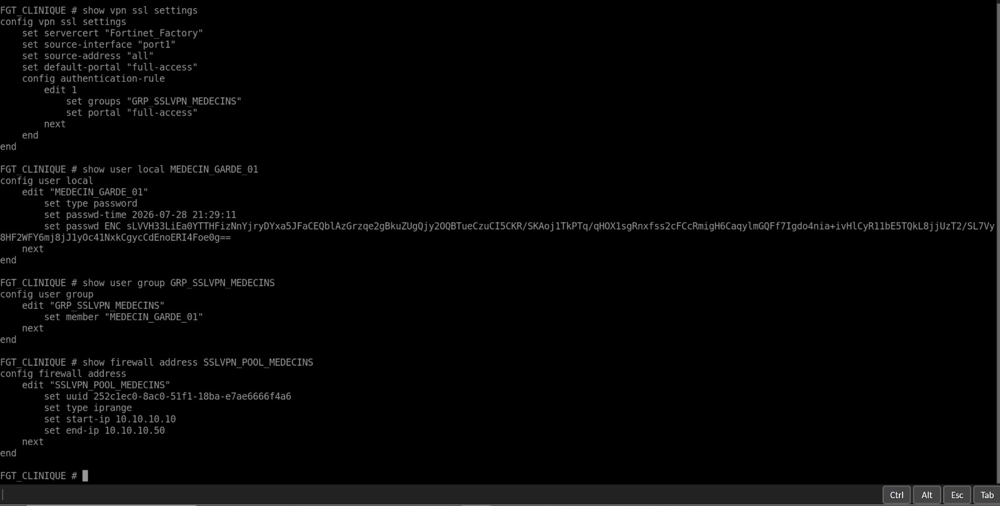

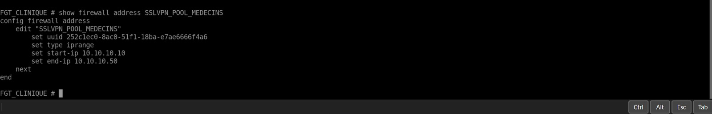

### FortiAnalyzer & Security Monitoring

FortiAnalyzer is used to centralize, monitor and analyze FortiGate security logs.

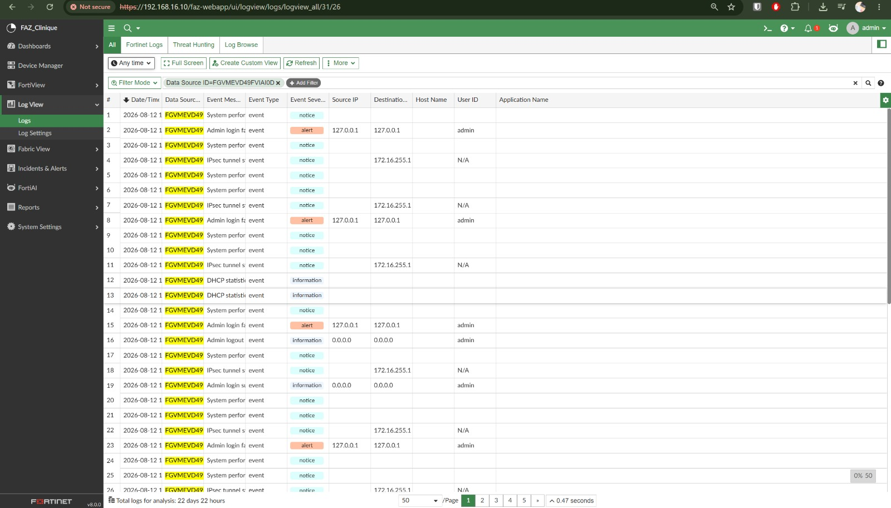

## Security Flows

### Site-to-Site IPsec Communication

This diagram illustrates the communication flow between the clinic and the remote laboratory through the site-to-site IPsec VPN.

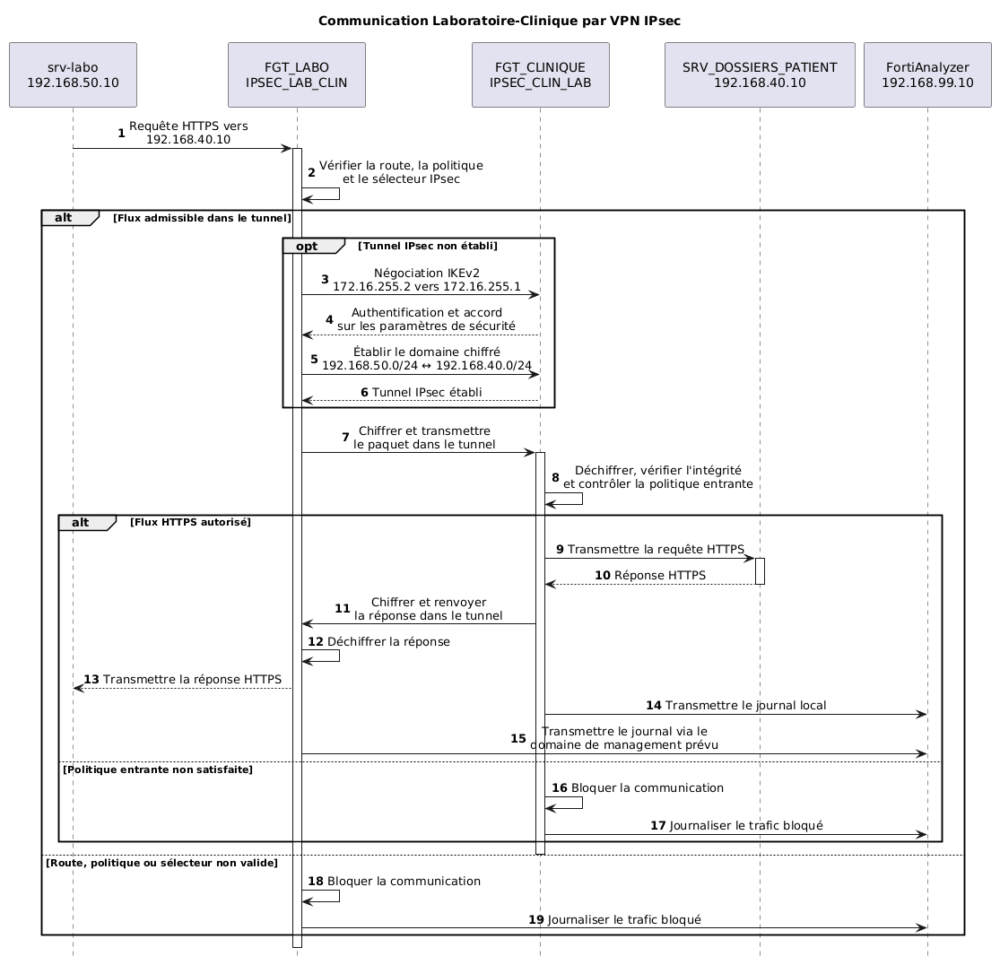

### SSL-VPN Remote Access

This diagram illustrates the secure remote-access flow for medical staff, including authentication, address assignment, policy enforcement and logging.

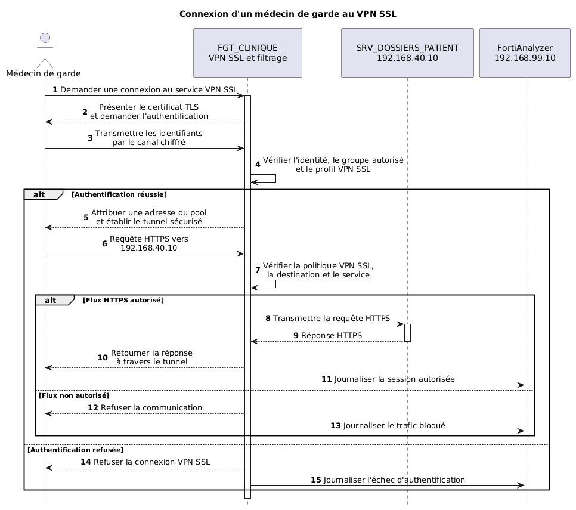

### Patient Portal Access

This diagram illustrates the communication flow between a patient and the MediClinic patient portal.

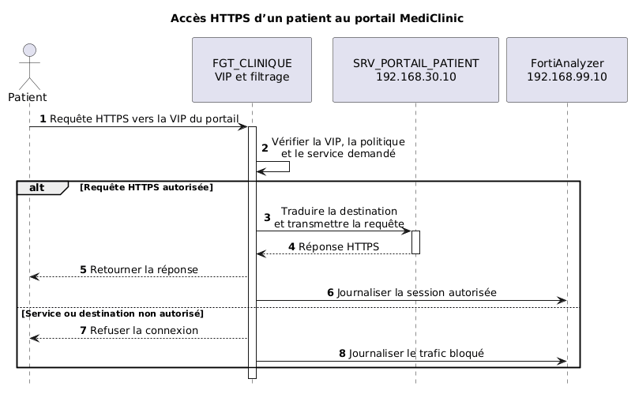

## Validation

The solution was validated through:

* Inter-VLAN connectivity tests
* Site-to-site IPsec connectivity tests
* SSL-VPN access tests
* Firewall policy verification
* Network service accessibility tests
* FortiAnalyzer log collection and monitoring

Screenshots, diagrams and configuration evidence are provided throughout the repository.

## Author

**Yassine Alahyane**

Cybersecurity Engineering Student
