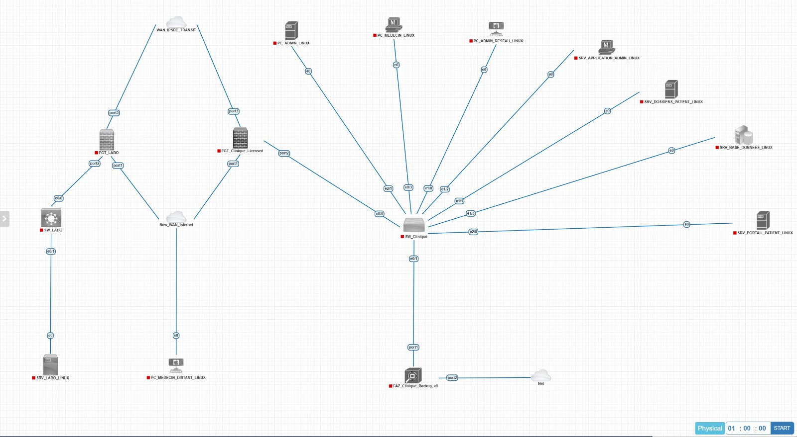

# MedSecure-FortiNet

## Secure Healthcare Network with FortiGate

Design and deployment of a secure network infrastructure for a healthcare environment using **FortiGate**, **FortiAnalyzer**, **IPsec VPN** and **SSL-VPN**.

## Overview

MedSecure-FortiNet is a cybersecurity networking project focused on securing communications, segmenting the infrastructure and monitoring network activity within a healthcare environment.

The project was designed and deployed in a virtualized laboratory environment using **PNETLab** and **VMware**.

## Key Features

* Network segmentation using VLANs
* Site-to-site IPsec VPN
* Secure remote access using SSL-VPN
* DMZ architecture
* Firewall security policies
* Centralized logging with FortiAnalyzer 
* Network monitoring and security analysis 

## Architecture



## Technologies

* FortiGate
* FortiAnalyzer
* IPsec VPN
* SSL-VPN
* VLAN
* PNETLab
* VMware

## Project Structure

```text
MedSecure-FortiNet/
│
├── docs/
│   ├── architecture/
│   ├── screenshots/
│   └── diagrams/
│
├── fortigate/
│   ├── clinique/
│   └── labo/
│
├── fortianalyzer/
│
├── vpn/
│   ├── ipsec/
│   └── ssl-vpn/
│
├── network/
│   ├── vlan/
│   └── ip-plan/
│
└── README.md
```

## Implementation

### VLAN Segmentation

The network is divided into dedicated VLANs to isolate users, servers and management traffic.

### IPsec VPN

An IPsec tunnel securely connects the clinic and laboratory sites.

### SSL-VPN

SSL-VPN provides secure remote access for authorized medical staff.

### FortiAnalyzer

FortiAnalyzer is used to centralize, monitor and analyze security logs.

## Validation

The solution was validated through connectivity, VPN, firewall and logging tests.

Screenshots and configuration evidence are provided in the repository.

## Author

**Yassine Alahyane**

Cybersecurity Engineering Student
