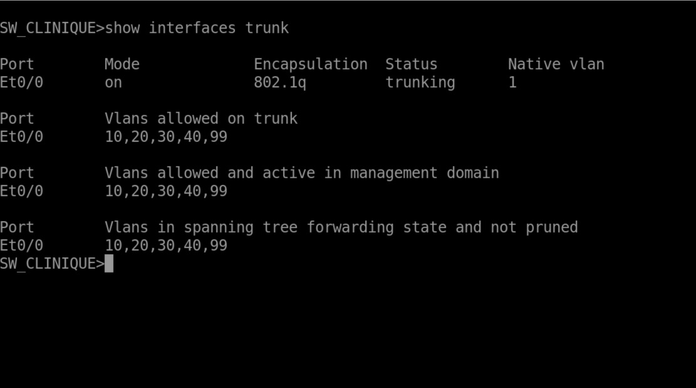

# VLAN Segmentation

## Overview

The MediClinic network is segmented into dedicated VLANs in order to isolate different categories of users and resources.

The segmentation is implemented through FortiGate and the internal switching infrastructure.

## VLAN Architecture

| VLAN    | Network           | Gateway        | Role           |
| ------- | ----------------- | -------------- | -------------- |
| VLAN 10 | `192.168.10.0/24` | `192.168.10.1` | Administration |
| VLAN 20 | `192.168.20.0/24` | `192.168.20.1` | Medical Staff  |
| VLAN 40 | `192.168.40.0/24` | `192.168.40.1` | Servers        |

## Security Objectives

The segmentation is designed to:

* Separate administrative users from medical staff
* Isolate server resources from user networks
* Reduce unnecessary lateral communication
* Apply security policies between network zones
* Control access to sensitive resources
* Improve network visibility and monitoring

## VLAN 10 — Administration

```text
Network: 192.168.10.0/24
Gateway: 192.168.10.1
```

This VLAN is dedicated to administrative users and infrastructure management traffic.

## VLAN 20 — Medical Staff

```text
Network: 192.168.20.0/24
Gateway: 192.168.20.1
```

This VLAN is dedicated to medical staff devices and related access requirements.

## VLAN 40 — Servers

```text
Network: 192.168.40.0/24
Gateway: 192.168.40.1
```

This VLAN hosts the server infrastructure and protected application resources.

Access to this network is controlled through FortiGate firewall policies.

## Traffic Control

Communication between VLANs is not treated as unrestricted internal traffic.

FortiGate policies are used to control:

```text
Administration
      |
      | Controlled access
      v
Medical Staff
      |
      | Authorized access
      v
Servers
```

The objective is to allow required business communication while limiting unnecessary access between security zones.

## Validation

The VLAN architecture was validated through:

* VLAN interface verification
* Connectivity tests
* Inter-VLAN communication tests
* Firewall policy verification
* Access testing to protected resources

## Evidence





## Security Note

VLAN segmentation provides network isolation, but it is not considered a standalone security mechanism. Communication between the different zones is controlled through FortiGate firewall policies.
